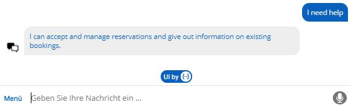
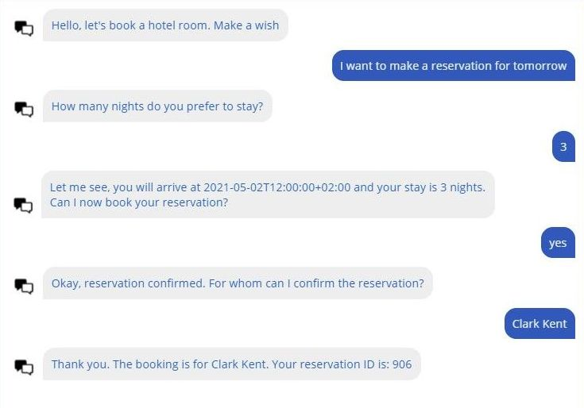
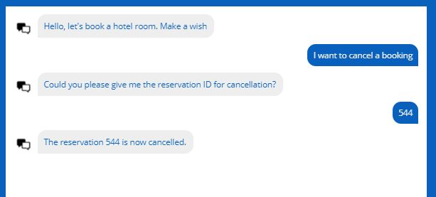
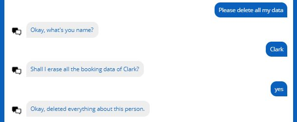
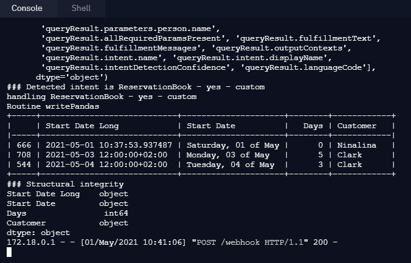
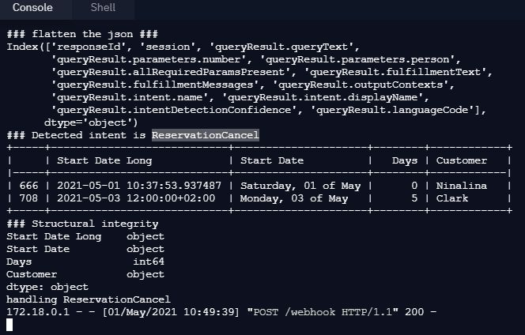
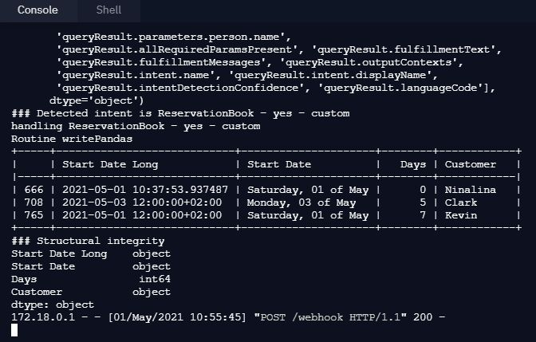
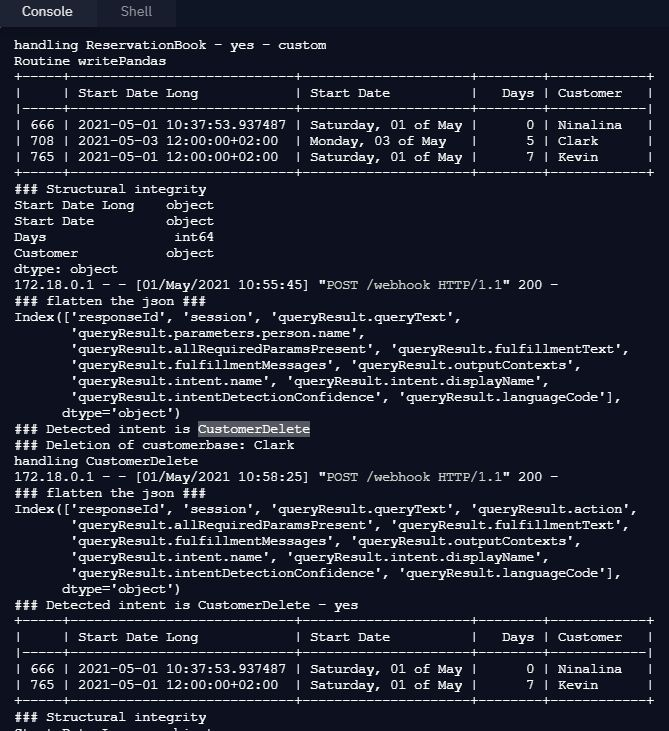

# Documentation

## Conception, Design and Implementation

- **Kevin Ostheimer**, Dipl.-Ing. (FH)
- GitHub-Repository: [Impulsleistung/HotelBot](https://github.com/Impulsleistung/HotelBot)
- Co-Author: NONE
- [License](https://github.com/Impulsleistung/HotelBot/blob/main/readme.md)
- AI-CLAUSE: Any implementation MUST follow the [Three Laws of Robotics](https://en.wikipedia.org/wiki/Three_Laws_of_Robotics)

## Purpose of the project

- End2End Development, Implementation, and Deployment of a HotelBot reservation system
- Usage of Artificial Intelligence with focus on
  - Natural Language Processing
  - Backend Server System
- 100% Cloud developed a prototype
- [Active Web-Frontend for demonstration](https://bot.dialogflow.com/kevin_hotelbot)
- [Frontend Web-Access](https://bot.dialogflow.com/kevin_hotelbot)
- [Backend Diagnostic Web-Access](https://hotelbotlive.impulsleistung.repl.co/)
- Link to paper presentation: ***.pdf (OneDrive)

## Structure of Documentation

- [x] Main Documentation: [readme.md](https://github.com/Impulsleistung/HotelBot/blob/main/readme.md)
- [x] Architecture as UML: [architecture](https://github.com/Impulsleistung/HotelBot/tree/main/architecture)
- [x] Pictures: [pictures](https://github.com/Impulsleistung/HotelBot/tree/main/pictures)

### Sourcecode

- [x] Frontend Chatbot Dialogflow: [dialogflow_HotelBot](https://github.com/Impulsleistung/HotelBot/tree/main/dialogflow_HotelBot)
- [x] Backend Flask: [main.py](https://github.com/Impulsleistung/HotelBot/blob/main/main.py)
- [x] Flask Bootsequence: [upstart.sh](https://github.com/Impulsleistung/HotelBot/blob/main/upstart.sh)
- [x] Replit Init: [.replit](https://github.com/Impulsleistung/HotelBot/blob/main/.replit)

### Debug Output

- [x] Dialogflow-Webhook as Flat-JSON: [fromDialogflow_NORM.csv](https://github.com/Impulsleistung/HotelBot/blob/main/fromDialogflow_NORM.csv)
- [x] Customer Datebase (pd_init): Console

## System Architecture

## Dialogflow Schema

List of implemented intents:

Dialogflow Architecture

## Flask Schema

Backend Architecture

## Dialogflow Intent Implementation

- Path: [dialogflow_HotelBot/intents/](https://github.com/Impulsleistung/HotelBot/tree/main/dialogflow_HotelBot/intents)

## CustomerDelete

- [x] [CustomerDelete.json](https://github.com/Impulsleistung/HotelBot/blob/main/dialogflow_HotelBot/intents/CustomerDelete.json)

Training Data:

### CustomerDelete - no

- [x] [CustomerDelete - no.json](https://github.com/Impulsleistung/HotelBot/blob/main/dialogflow_HotelBot/intents/CustomerDelete%20-%20no.json)

The standard Dialogflow follow-up for denial is used. No explicit phrases

### CustomerDelete - yes

- [x] [CustomerDelete - yes.json](https://github.com/Impulsleistung/HotelBot/blob/main/dialogflow_HotelBot/intents/CustomerDelete%20-%20yes.json)

The standard Dialogflow followup for denial is used. No explicit phrases

## CustomerHelp

- [x] [CustomerHelp.json](https://github.com/Impulsleistung/HotelBot/blob/main/dialogflow_HotelBot/intents/CustomerHelp.json)

Training Data:

Defined Response:

## ReservationBook

- [x] [ReservationBook.json](https://github.com/Impulsleistung/HotelBot/blob/main/dialogflow_HotelBot/intents/ReservationBook.json)

Training Data:

Configuration of action parameters and response

### ReservationBook - cancel

The customer decides *not to confirm* the reservation

- [x] [ReservationBook - cancel.json](https://github.com/Impulsleistung/HotelBot/blob/main/dialogflow_HotelBot/intents/ReservationBook%20-%20cancel.json)

The standard Dialogflow follow-up for cancel. No explicit phrases

### ReservationBook - yes

The customer decides to *confirm* the reservation

- [x] [ReservationBook - yes.json](https://github.com/Impulsleistung/HotelBot/blob/main/dialogflow_HotelBot/intents/ReservationBook%20-%20yes.json)

The standard Dialogflow follow-up for confirmation. No explicit phrases

### ReservationBook - yes - custom

- [x] [ReservationBook - yes - custom.json](https://github.com/Impulsleistung/HotelBot/blob/main/dialogflow_HotelBot/intents/ReservationBook%20-%20yes%20-%20custom.json)

Training Data and parameters:

## ReservationCancel

- [x] [ReservationCancel.json](https://github.com/Impulsleistung/HotelBot/blob/main/dialogflow_HotelBot/intents/ReservationCancel.json)

Training Data and parameters:

  
## ReservationGet

- [x] [ReservationGet.json](https://github.com/Impulsleistung/HotelBot/blob/main/dialogflow_HotelBot/intents/ReservationGet.json)

Training Data and parameters:

## *Default Fallback Intent* and *Default Welcome Intent*

- [x] [Default Fallback Intent.json](https://github.com/Impulsleistung/HotelBot/blob/main/dialogflow_HotelBot/intents/Default%20Fallback%20Intent.json)
- [x] [Default Welcome Intent.json](https://github.com/Impulsleistung/HotelBot/blob/main/dialogflow_HotelBot/intents/Default%20Welcome%20Intent.json)

The standard Dialogflow template is adapted by a HotelBot specific text

## Code: main routine

Flask-Server code: [main.py](https://github.com/Impulsleistung/HotelBot/blob/main/main.py)

## Training data

## Frontend view

Intents
Ask for help:

Make a booking for Kevin:

Make a booking for Clark Kent:

Cancel a booking:

Delete all data of Clark (GDPR):

### Flask console debugging

The bash console in Replit shows the updates to the database.

Multiple bookings for one customer:

Cancel of the bookings of Clark:

Make a room reservation for Kevin:

Delete all data of Clark:

## Backend trace debugging

- [Native CSV Stream](https://github.com/Impulsleistung/HotelBot/blob/main/fromDialogflow_NORM.csv) for online preview in GitHub
- [Optical enhanced CSV in LibreOffice](https://github.com/Impulsleistung/HotelBot/blob/main/intent_debug_traces.ods) for offline usage

## Console view

## Known Errors

- [ ] User request for non-existent reservation ID
- [ ] User wants to delete a customer which does not exist

## Possible Improvements for production

- [ ] Remove all global variables and replace them with a real Sqlite. DB
- [ ] [Productive Deployment](https://dashboard.heroku.com/apps)
- [ ] Automated Unit-Tests for Flask
- [ ] Automated Unit-Tests for Dialogflow
- [ ] Architectural cut between systems- and software-level
- [ ] Dialogflow - Migration from ES to CX environment
- [ ] Definition of staging environments (dev, pre-live, live)
- [ ] [Establish a Systems Engineering approach](https://www.nasa.gov/connect/ebooks/nasa-systems-engineering-handbook)

## Tooling

- [x] [UML diagrams in Plantuml](https://www.planttext.com)
- [x] [Flask Prototyping Backend](https://dialogflow.impulsleistung.repl.co)
- [x] [Flask Live Backend](https://live.impulsleistung.repl.co)
- [x] [Dialogflow Live trained Agent](https://bot.dialogflow.com/kevin_hotelbot)
- [x] [Dialogflow Frontend](https://portal.botcopy.com)
- [x] [CI/CD](https://github.com/Impulsleistung)
