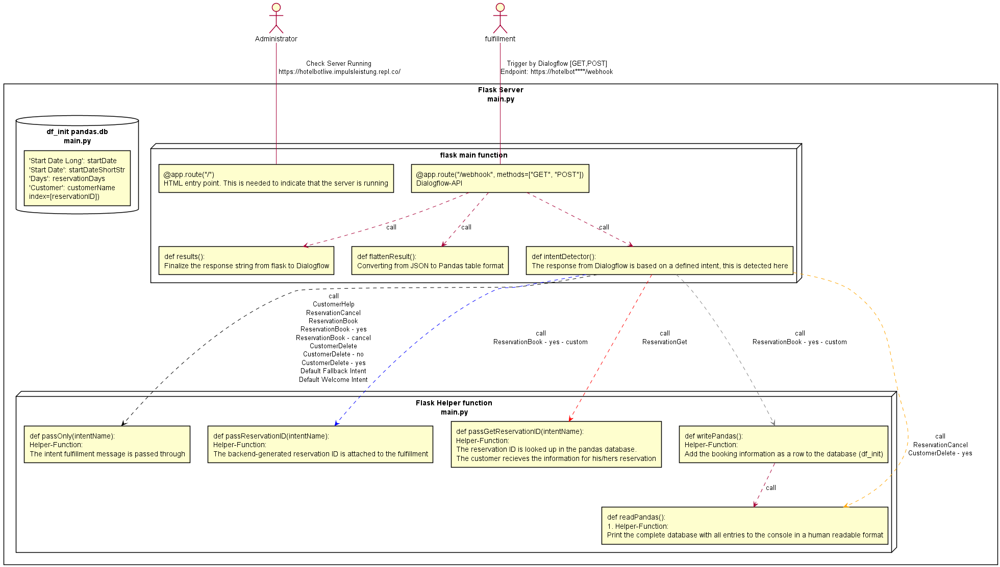
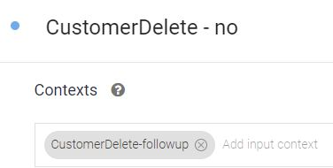
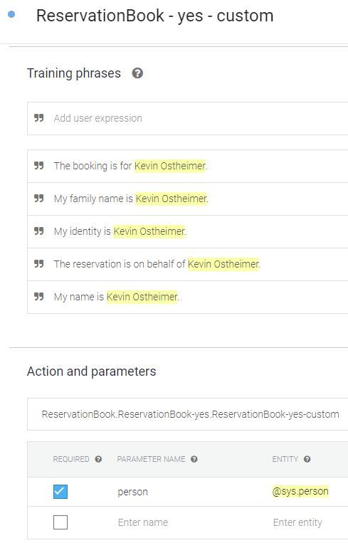

# Documentation

## Author / Designer

- **Kevin Ostheimer, Dipl.-Ing.(FH), Pub.Reg.-Nr.: 3203785**
- Institution: Public
- Co-Author: NONE

## Purpose of the project

- End2End Development, Implementation, and Deployment of a HotelBot reservation system
- Usage of Artificial Intelligence with focus on
  - Natural Language Processing
  - Backend Server System
- 100% Cloud developed a prototype
- Active Web-Frontend for demonstration: <https://bot.dialogflow.com/kevin_hotelbot>
- [x] Frontend Web-Access: <https://bot.dialogflow.com/kevin_hotelbot>
- [x] Backend Diagnostic Web-Access: <https://hotelbotlive.impulsleistung.repl.co/>
- [ ] Link to paper presentation: ***.pdf

### License

- GPLv3, <https://github.com/Impulsleistung/HotelBot/blob/main/LICENSE>
- AI-CLAUSE: Any implementation MUST follow the [Three Laws of Robotics](https://en.wikipedia.org/wiki/Three_Laws_of_Robotics)

## Structure of Documentation

- [x] Main Documentation: [#readme.md](https://github.com/Impulsleistung/HotelBot/blob/main/readme.md)
- [x] Architecture as UML: [#architecture/](https://github.com/Impulsleistung/HotelBot/tree/main/architecture)
- [x] Pictures: [#pictures/](https://github.com/Impulsleistung/HotelBot/tree/main/pictures)

### Sourcecode

- [x] Frontend Chatbot Dialogflow: [#dialogflow_HotelBot/](https://github.com/Impulsleistung/HotelBot/tree/main/dialogflow_HotelBot)
- [x] Backend Flask: [#main.py](https://github.com/Impulsleistung/HotelBot/blob/main/main.py)
- [x] Flask Bootsequence: [#upstart.sh](https://github.com/Impulsleistung/HotelBot/blob/main/upstart.sh)
- [x] Replit Init: [#.replit](https://github.com/Impulsleistung/HotelBot/blob/main/.replit)

### Debug Output

- [x] Dialogflow-Webhook as Flat-JSON: [#fromDialogflow_NORM.csv](https://github.com/Impulsleistung/HotelBot/blob/main/fromDialogflow_NORM.csv)
- [x] Customer Datebase (pd_init): Console

## Not included in Main Documentation

- [ ] Access Credentials: Google, Replit
- [ ] Endpoint Configuration: <https://****/webhook>

## System Architecture

Overview

## Dialogflow Schema

List of Intents

Dialogflow Architecture

## Flask Schema

Backend Architecture

## Dialogflow Intent Implementation

- Path: #dialogflow_HotelBot/intents/

## CustomerDelete

- [x] CustomerDelete.json
Training Data:

### CustomerDelete - no

- [x] 'CustomerDelete - no.json'

The standard Dialogflow followup for denial is used. No explicit phrases

### CustomerDelete - yes

- [x] 'CustomerDelete - yes.json'

The standard Dialogflow followup for denial is used. No explicit phrases

## CustomerHelp

- [x] CustomerHelp.json
Training Data:

Defined Response:

## ReservationBook

- [x] ReservationBook.json
Training Data:

Configuration of action parameters and response

### ReservationBook - cancel

The customer decides to *not confirm* the reservation

- [x] 'ReservationBook - cancel.json'

The standard Dialogflow follow-up for cancel is used. No explicit phrases

### ReservationBook - yes

The customer decides to *confirm* the reservation

- [x] 'ReservationBook - yes.json'

The standard Dialogflow follow-up for confirmation is used. No explicit phrases

### ReservationBook - yes - custom

- [x] 'ReservationBook - yes - custom.json'
Training Data and parameters:

## ReservationCancel

- [x] ReservationCancel.json
Training Data and parameters:

  
## ReservationGet

- [x] ReservationGet.json
Training Data and parameters:

## *Default Fallback Intent* and *Default Welcome Intent*

- [x] 'Default Fallback Intent.json'
- [x] 'Default Welcome Intent.json'

The standard Dialogflow template is adapted by a HotelBot specific text

## Code: main.py

The Flask-Server code is commented in [#main.py](https://github.com/Impulsleistung/HotelBot/blob/main/main.py)

## Training data

## Frontend view

### Booking

### Booking Request

### Reservation cancel

### Delete Customer

### Ask for help

## Backend view in CSV

## Console view

## Possible Improvements for production

- Remove all global variables and replace them with a real Sqlite. DB
- Deploy on <https://dashboard.heroku.com/apps>
- Automated Unit-Tests for Flask
- Automated Unit-Tests for Dialogflow
- Establish a development process based on Lessons learned and systems engineering
- Architectural cut between systems- and software-level
- GitHub-Style CI/CD
- Dialogflow - Migration von ES auf die CX Entwicklungsumgebung
- Clear definition of staging environments (dev, pre-live, live)
- Link requirements to tests and functions in the code (SPICE)

## Tooling

- [x] UML diagrams in Plantuml, <https://www.planttext.com>
- [x] Flask Prototyping Backend, <https://dialogflow.impulsleistung.repl.co>
- [x] Flask Live Backend, <https://live.impulsleistung.repl.co>
- [x] Dialogflow Live trained Agent, <https://bot.dialogflow.com/kevin_hotelbot>
- [ ] Dialogflow Frontend, <https://portal.botcopy.com>
- [ ] CI/CD, <https://github.com/Impulsleistung>
